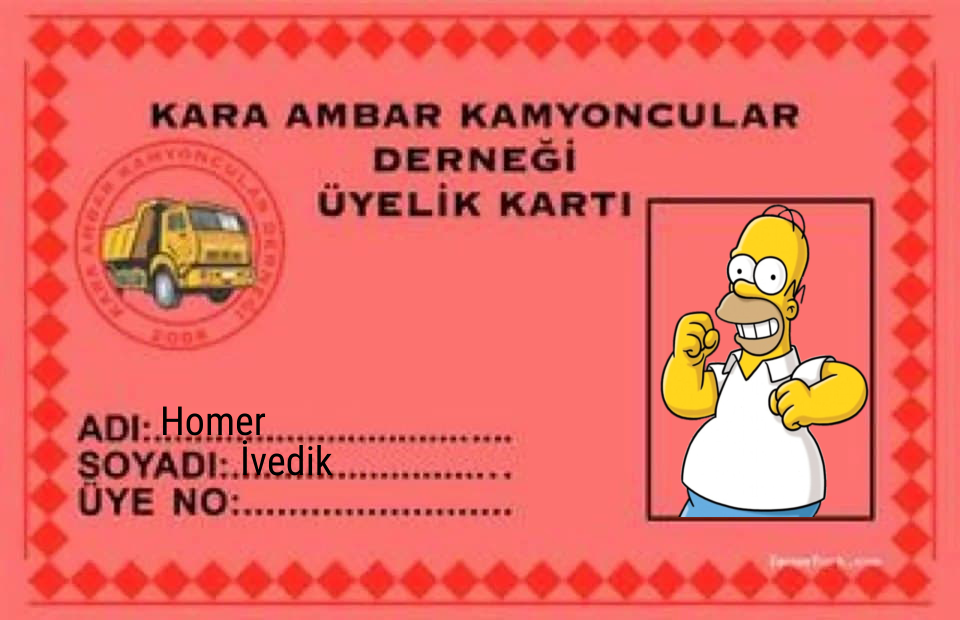

# KaraAmbarKart
 Go, [gg](https://github.com/fogleman/gg) kütüphanesi ile *eğlence amaçlı* hazırlanmış otomatik kart dolduran eleman.
 
 <!-- -->
 
 
 ```go

import (
	"github.com/raifpy/KaraAmbarKart"
)

func _() {
	kart, _ := KaraAmbarKart.YeniKart()

	h, _ := os.Open("image.png")
	defer h.Close()

	res, _ := kart.AycicekYagi("Rivcep", "Vedik", "000045", h)

	f, _ := os.Create("out.png")
	KaraAmbarKart.Buf(res).WriteTo(f)
	f.Close()

}
 ```
 
 ```python
 import requests
 res = requests.get("https://api.codeksion.net/fun/karaambar",files={"photo":open("homer.png","rb")},data={"name":"Homer","surname":"İvedik"})
 ...
 ```
